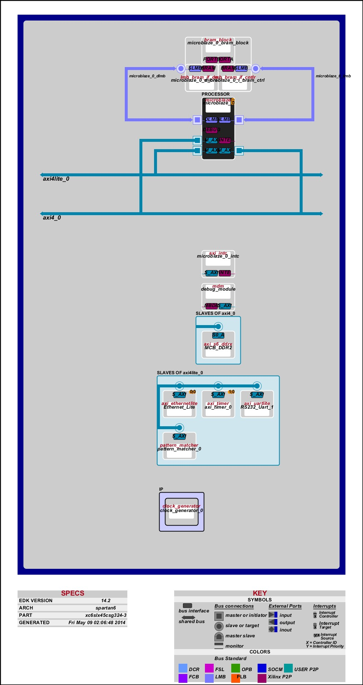
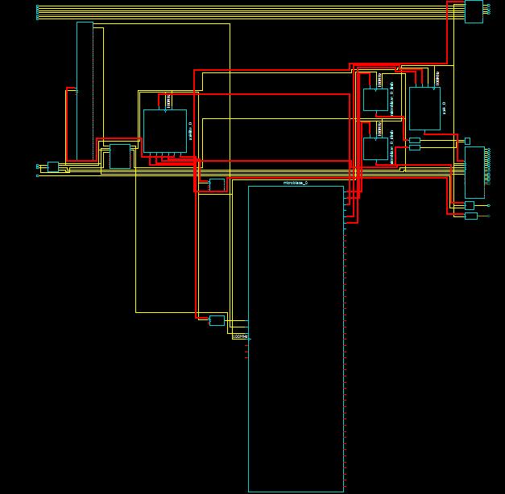
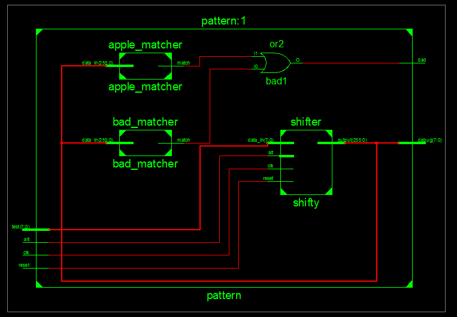
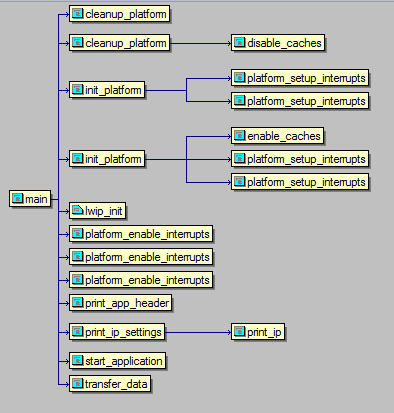

# ECE 383 Final Project #
## Table of Contents ##
- [Introduction](#introduction)
- [Approach](#approach)
- [Implementation](#implementation)
    - [Top Shell Diagram](#top-shell-diagram)
        - [Block Diagram](#block-diagram)
        - [Graphical Design Diagram](#graphical-design-diagram)
        - [Project Report](#project-report)
    - [Pattern Matcher Diagram](#pattern-matcher-diagram)
    - [C Call Diagram](#c-call-diagram)
    - [Ethernet](#ethernet)
    - [Pattern Matching](#pattern-matching)
- [Testing and Debugging](#testing-and-debugging)
    - [Microblaze Ethernet](#microblaze-ethernet)
    - [Pattern Matching Hardware](#pattern-matching-hardware)
    - [Pattern Matching Ethernet](#pattern-matching-ethernet)
- [Conclusion](#conclusion)
- [Documentation](#documentation)

## Introduction ##
The purpose of this project was to propose our own project.  This included a sign-off schedule, design, build and testing of my proposed design.  In addition to technical work, a final presentation, report and video must be included in the project to demonstrate understanding.  The project was graded off the following criteria:

 1. Complexity of hardware and software design
 2. Quality of documentation, final report, and presentation
 3. Amount of effort demonstrated
 4. Functionality of project based off proposed requirements

The meet the aforementioned requirements, I proposed an interesting, but not entirely novel, idea of implementing hardware level pattern matching for Ethernet packets.  There were three proposed levels of functionality for the project given by:

 1. Required Functionality - Determine number of packets passing through Ethernet and output to UART
 2. B - Frame buffer to hold intermediate packets
 3. A - Match a packet to a sample NIDS rule

During the implementation of the project, it was determined that the B functionality could be accomplished using a much simpler FIFO instead of a homegrown solution for intermediate data storage.

## Approach ##
As given in the levels of functionality, Ethernet needed to be implemented in order for anything further to be accomplished for this project.  After several attempts to implement a simple IP stack using the Ethernet Lite module provided by Xilinx CORE, the design was made to use the provided Microblaze implementation of Ethernet.

Once the problem of how Ethernet was going to be received, the contents of the packets needed to be displayed to the serial connection of the computer to verify that results matching their expected outputs.  The best way to achieve this was using the UART implementation from a previous lab.

THe last step was determining how to get the received data from the Microblaze processor to my custom peripheral that did the pattern matching.  Once that was achieved, getting a signal back from the module was necessary in order to visually determine over the serial connection whether a bad packet had been detected.

## Implementation ##

### Top Shell Diagram ###

#### Block Diagram ####

#### Graphical Design Diagram ####

#### Project Report ####

[Interactive EDK Design Report](https://rawgit.com/KevinCooper/final_project_2/master/images/report/system.html)

### Pattern Matcher Diagram ###

 
### C Call Diagram ###

  

### Ethernet ###

### Pattern Matching ###

## Testing and Debugging ##

### Microblaze Ethernet ###

### Pattern Matching Hardware ###

### Pattern Matching Ethernet ####

## Conclusion ##

## Documentation ##
The FIFO used to stream in the pattern matcher was pulled from a design off the internet.  The link is in the appropriate file.
